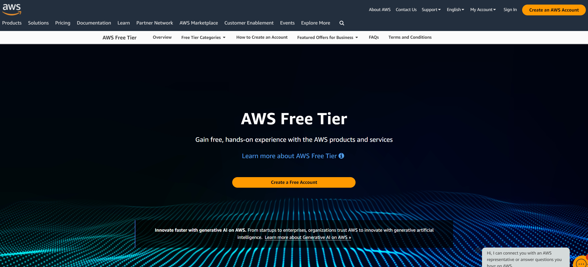
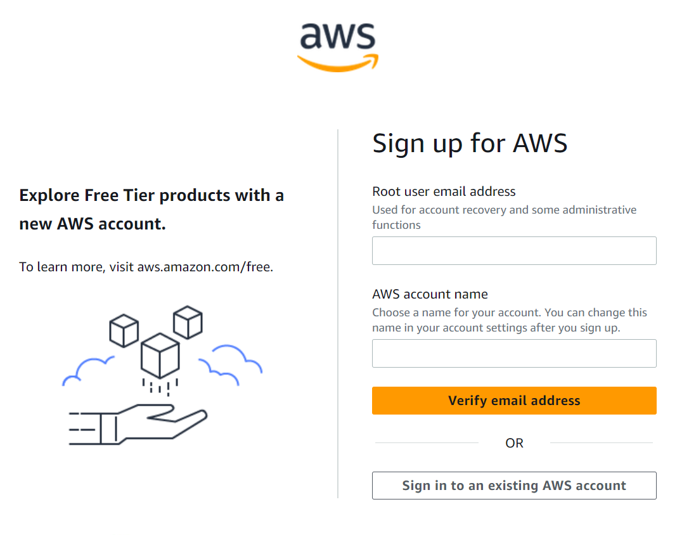
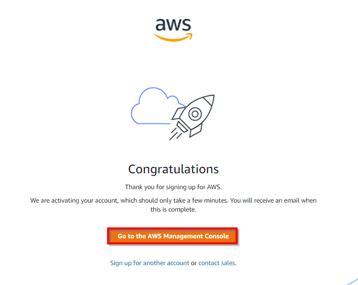

# Create an AWS Account (Free tier)

This article will help you understand how to create AWS Free Tier Account. For more details, checkout the official documentation here:

### Step-01: Launch your web browser and navigate to [AWS Free Tier](https://aws.amazon.com/free) page

### Step-02: Initiate the AWS Account creation process

- Click on the **Create a Free Account** button

### Step-03: Configure `Root User Email Address` and `Account name`

- **Root user email address**: Enter a valid email address that hasn't been registered yet with Amazon AWS. This field value will be the root username.
- **Password**: Set a sign-in password for your account
- **Confirm password**: Confirm the sign-in password by retyping it.
- **AWS Account name**: Choose a name for your account. You can change this name in your account settings after you sign up.

- Click on **Verify email address** button

### Step-04: Verify your email address

- Check your email inbox for an email notification from AWS regarding the email address verification. Kindly confirm it.

### Step-05: Provide Contact Information

- **AWS type (Profesional/ Personal)**: Personal Account
- **Phone No**: <valid_phone_no>
- **Country**: <country_name>
- **Address**: <your_address_here>

- **Accept the Terms and condition** and then click on **Create Account** and **Continue**

### Step-06: Provide Payment and PAN information

- On this step, you must fill in your **credit card** details and **billing address**.
- **Do you have a PAN?**: Yes
- Click on **Verify and Continue** button.
- It will take you to the bank's payment gateway page to verify the entered credit card information.
- Amazon will charge the minimum price based on the country you're located in. Here, I've considered country as India, so Amazon will charge you 2 INR.

### Step-07: Confirm your identity

- Select your preference for recieving the OTP out of following options:
  - Text message (SMS)
  - Voice call
- Enter the recieved code, enter the captcha and move to next step.

### Step-08: Select the support plan

- **Support plan**: Basic support - Free

### Step-09: Registration confirmation

- Once you will complete all the above steps, you'll be navigated to the Congratulations page as shown below:

- Now, your account will be processed for activation which may take somewhere between 5 minutes to 1 hour.
- As soon as your AWS account is activated and ready for use, you will receive an email confirmation that your Amazon Cloud Services account has been activated successfully.

### Step-10: Access AWS Management Console

- Navigate to AWS Management console: https://console.aws.amazon.com/
- **User Type**: Root user
- **Username**: <root_user_email_address>
- **Password**: <root_user_password>
