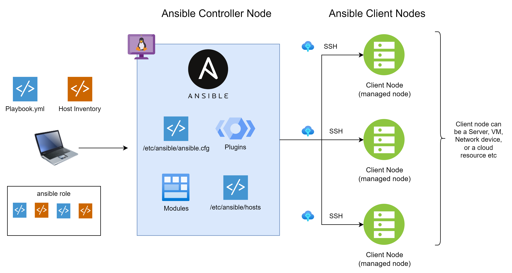

# Demystifying Ansible Architecture

In this section, we will explore ansible architecture and learn below concepts:

- **Control Nodes**

- **Client Nodes**

- **Inventory**
- **Modules**
- **Tasks**
- **Playbooks**

## Ansible Architecture

### 01. Control Nodes

- Control node is any machine with Ansible installed.
- You can have multiple control nodes.
- You can run commands and playbooks, invoking /usr/bin/**ansible** or /usr/bin/**ansible-playbook**, from any control node.
- You can use any machine that has Python installed on it as a control node - laptops, virtual machines, and servers can all run Ansible.
- Controller node refer to **ansible.cfg** to connect to client nodes and perform various tasks.
- Ansible uses **SSH** to connect to all the remote servers and executes the tasks in parallel.

:warning: **You cannot use a Windows machine as a control node**

### 02. Client Nodes (also known as `Hosts` or `Managed Nodes`)

- Client nodes are the virtual machines/physical machines/network devices that you manage with Ansible
- You need not install Ansible on client nodes.
- That is why Ansible is also referred to as **Agentless**.

### 03. Inventory (also known as `Hosts file`)

- _Inventory_ or _Hosts file_ is a special file which is with all the client nodes connection details.
- Inventory can specify information like IP address, Username & Password/keypair to be used to connect to client nodes.
- An inventory also provides you with a way of organizing client nodes, by creating and nesting groups for easier scaling.

### 04. Playbook and Play

- **Playbooks** are ordered lists of _plays_.
- A play is a collection of _Tasks_
- _Task_ is an action to be performed on client nodes (e.g install a package, start a service etc.)
- Playbooks are written in YAML and are easy to read, write, share and understand.

### 06. Tasks

- Tasks are the basic unit of action in Ansible.
- For more details, refer documentation.

### 07. Modules
