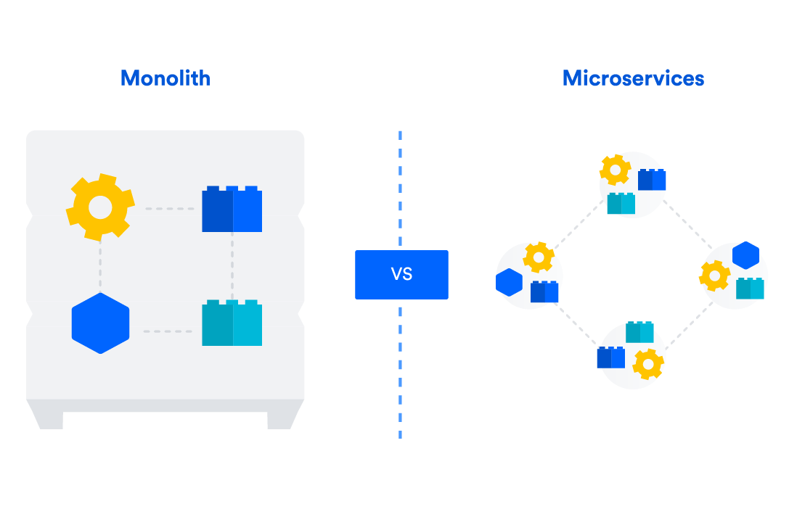

# Containers Fundamentals

## Problem Statement: Issues with Traditional Apps

-

## What is a `Container`?

- A **Container** is a standard unit of software that packages up code and all its dependencies so the application runs quickly and reliably from one computing environment to another.

## The `Evolution of Containers`

## [Connect with `Docker Community`](https://www.docker.com/community/)

## `Monolithic App Architecture` vs `Microservices Architecture`

### 1. What is a monolithic architecture?

- A monolithic architecture is a singular, large computing network with one code base that couples all of the business concerns together.
- To make a change to this sort of application requires updating the entire stack by accessing the code base and building and deploying an updated version of the service-side interface.
- This makes updates restrictive and time-consuming.

### 2. What are microservices?

- A microservices architecture, also simply known as **microservices**
- It is an architectural method that relies on a series of independently deployable services.
- These services have their own business logic and database with a specific goal. Updating, testing, deployment, and scaling occur within each service.
- Microservices decouple major business, domain-specific concerns into separate, independent code bases.
- Microservices don't reduce complexity, but they make any complexity visible and more manageable by separating tasks into smaller processes that function independently of each other and contribute to the overall whole.

###

