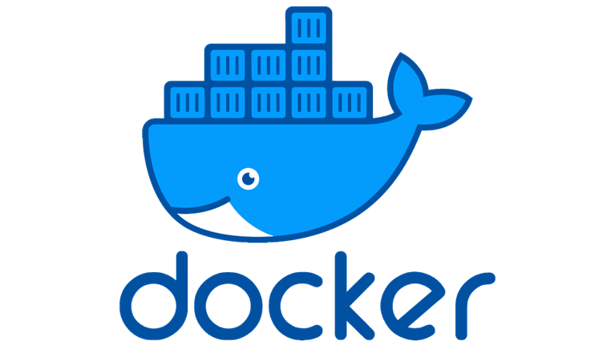
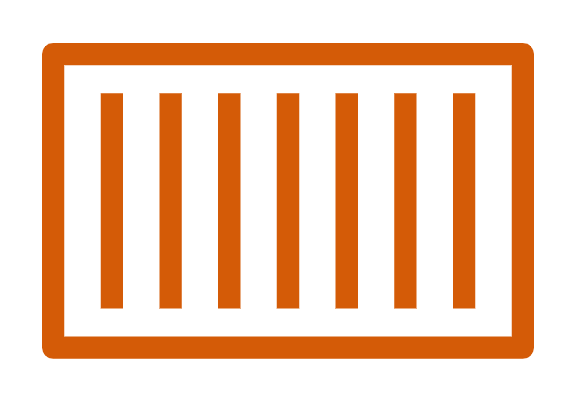
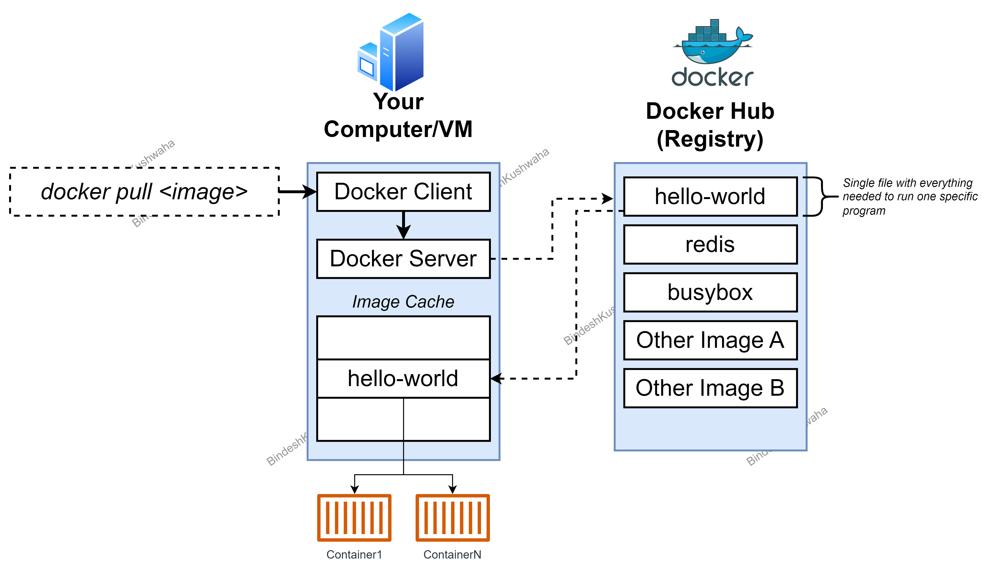
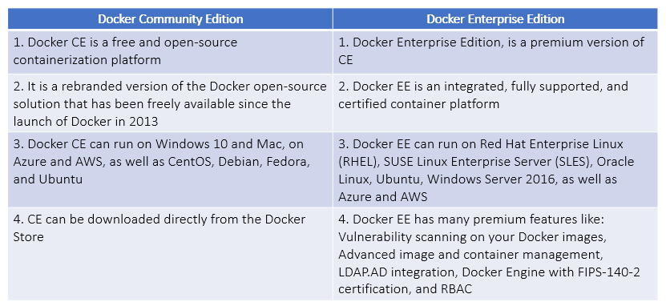
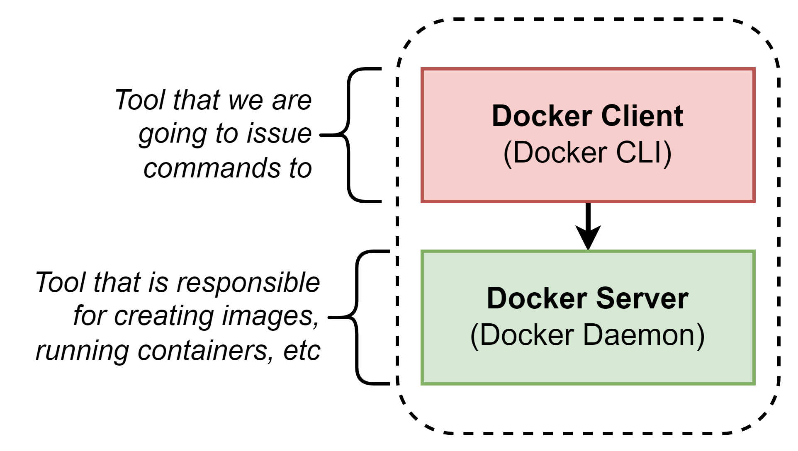

# 1. Docker Overview

## 1.1 What is Docker?

- **Docker** is an open platform for developing, shipping, and running applications.
- **Docker** enables you to separate your applications from your infrastructure so you can deliver software quickly.
- **Docker** is a set of platform as a service products that use OS-level virtualization to deliver software in packages called **Containers**.
- The service has both free and premium tiers.
- The software that hosts the containers is called Docker Engine.
- It was first started in 2013 and is developed by Docker, Inc

## 1.2 Why use Docker?

- With **Docker**, you can manage your infrastructure in the same way you manage your applications
- By taking advantage of Docker’s methodologies for shipping, testing, and deploying code quickly, you can significantly reduce the delay between writing code and running it in production
- Docker provides the ability to package and run an application in a loosely isolated environment called a Container
- The isolation and security allow you to run many containers simultaneously on a given host

## 1.3 What is a Docker Container?

- A **Container** is a standard unit of software that packages up code and all its dependencies so the application runs quickly and reliably from one computing environment to another.
- A Docker container image is a lightweight, standalone, executable package of software that includes everything needed to run an application: code, runtime, system tools, system libraries and settings.

## 1.4 Advantages of running application in Docker Containers

1.  **Standard**: Docker created the industry standard for containers, so they could be portable anywhere
2.  **Lightweight**: Containers share the machine’s OS system kernel and therefore do not require an OS per application, driving higher server efficiencies and reducing server and licensing costs
3.  **Secure**: Applications are safer in containers and Docker provides the strongest default isolation capabilities in the industry
4.  **Loosely coupled**
5.  **Scalable**

## 1.5 Docker: Architecture

## 1.6 Docker: The underlying Technology

- Docker is written in the Go programming language and takes advantage of several features of the Linux kernel to deliver its functionality
- Docker uses a technology called **Namespaces** to provide the isolated workspace called the _Container_
- When you run a container, Docker creates a set of namespaces for that container
- These namespaces provide a layer of isolation
- Each aspect of a container runs in a separate namespace and its access is limited to that namespace

## 1.7 Docker: Editions (CE and EE)

## 1.8 Docker Desktop vs Docker Engine

## 1.9 Docker: Key Terminologies

1.  **Docker Daemon or Docker Engine** : The Docker Daemon (dockerd) listens for the Docker API requests and manages Docker objects, such as images, containers, networks and volumes

2.  **Docker Client** : Docker client is a CLI program that can be present on the Docker host or any other machine. IT is the primary way that to interact with Docker daemon over docker APIs

3.  **Docker Image** : A Docker image is a read-only template with instructions for creating a Docker container

4.  **Docker Container** : A Container is a runnable instance of a docker image. We can create, start, stop, move, or delete a container using docker API or command line
5.  **Docker Registry** : A Docker registry stores Docker images. _Docker Hub_ is a public registry that anyone can use, and Docker is configured to look for images on Docker Hub by default. You can even run your own private registry

6.  **Docker Obects** :

   
## 1.10 Docker: Reference Links
   - [Docker Overiew](https://docs.docker.com/get-started/overview/)
   - [Docker Desktop](https://docs.docker.com/desktop/)
   - [Docker Engine](https://docs.docker.com/engine/)
   - [Install Docker Engine](https://docs.docker.com/engine/install/)
   - [Docker Images and Build](https://docs.docker.com/build/)
   - [Docker Storage](https://docs.docker.com/storage/)
   - [Docker Networking](https://docs.docker.com/network/)
   - [Docker Compose](https://docs.docker.com/compose/)
   - [Docker Swarm](https://docs.docker.com/get-started/orchestration/)
