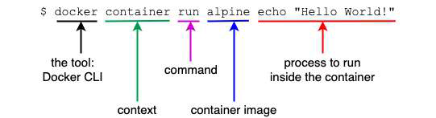
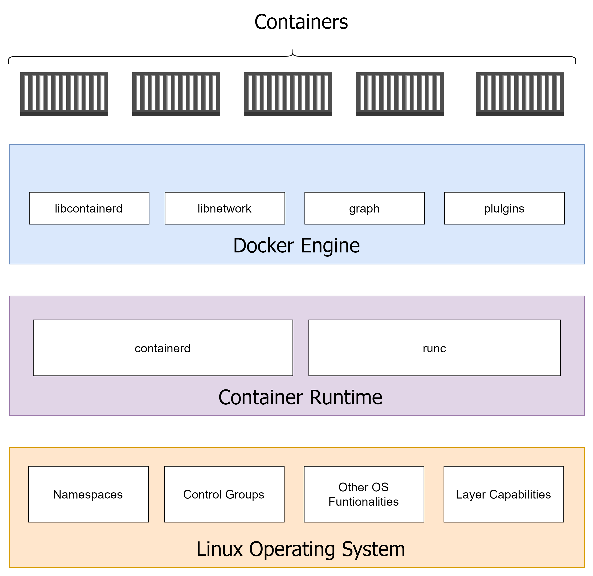

# Mastering Containers


## Understanding Docker Container Lifecycle


- The possible states of a Docker container are as follows:
  - **Created**: A container that has been created but not started.
  - **Restarting**: A container that is in the process of being restarted.
  - **Running**: A currently running container.
  - **Paused**: A container whose processes have been paused.
  - **Exited**: A container that ran and completed.
  - **Dead**: A container that Docker Engine tried and failed to stop.

## Hands-on Labs

Connect to your Docker host and perform below tasks:

### Step-01: `Running` the first container

```
# Pull the alpine linux image from Docker Hub (registry)
docker pull alpine

# Create a container from Alpine image
docker container run alpine echo "hello world"

# Another example of creating container
docker container run centos ping -c 5 127.0.0.1

# In the above eg., we're using is centos container image.
# The process we're executing inside the centos container is ping -c 5 127.0.0.1, which pings the loopback IP address five times until it stops.

# Listing all the running containers
docker container ls

# List all the Containers defined on your system (running+others)
docker container ls --all

# List just the IDs of all containers. Use -q or --quiet parameter
docker container ls --quiet
```



### Step-02: `Starting`, `Stopping`, and `Removing` containers

```
# Create a Container from Apache web server image
docker container run -dit --name webapp -p 80:80 httpd

# Stop the Container | SIGTERM | SIGKILL
docker container stop <container_id_or_name>

# Start the Container
docker container start <container_id_or_name>

# Remove/Delete a Container
docker container rm <container_id_or_name>

# Removing all the Containers, including the stopped ones
docker container rm --force $(docker container ls --all --quiet)
```

### Step-03: `Inspecting` Containers

- To get more information about a specific container, we can use the inspect command.
- We have to provide either the container ID or the name to identify the container or which we want to obtain the data.

```
# Create a new Container if not already there
docker container run -dit --name webapp -p 80:80 httpd

# Inspect the Container | More details about the container
docker container inspect <container_id_or_name>

# In case you need just a tiny bit of the overall container info, use the grep tool or a filter.
docker container inspect -f "{{json .State}}" <container_name_or_id>
```

### Step-04: `Exec` into a running container

- Sometimes, we want to run another process inside an already-running container.
- A typical reason could be to try to debug a misbehaving container.
- First, we must know which process we want to run and how we want it to run.

```
# Run a shell interactively inside a container
docker container exec -i -t busybox /bin/sh

# -i (--interactive) flag signifies that we want to run the additional process interactively
# -t (or --tty) tells Docker to provide us with a TTY (a terminal emulator) for
the command.
# After running the above cmd, you'll land on Bourne shell inside the container

# To check the running process inside the container
ps

# To exit from container shell
exit
```

### Step-05: Retrieving container logs

- It is a always a good practice for any application to generate some logging information to find out what the application is doing at a given time
- Also it helps us in figuring out if there are any issues in the app; the root cause of the issue.
- When running inside a container, the application should preferably output the log items to **STDOUT** and **STDERR** and not into a file.
- If the logging output is directed to **STDOUT** and **STDERR**, then Docker can collect this information and keep it ready for consumption by a user or any other external system.

```
# Run a container in detach mode
docker container run --detach /
--name <name_of_container> <docker_image_name>

# To access the logs of a given container
docker container logs <container_name_or_id>

# The above cmd will retrieve all the logs produced by the app from the very beginning of its existence.

# If we want just few of the latest entries, we can use the -t or --tail parameter
docker container logs --tail 5 <container_name_or_id>
```

- Docker includes multiple logging mechanisms to help us to get information from running containers commonly called as **logging drivers**.
- Which logging driver is used can be configured at the Docker daemon level.
- The default logging driver is **json-file**.

## `What are Containers`? | vs Virtual Machines

- Containers are specially encapsulated and secured processes running on the host system.
- Containers leverage a lot of features and primitives available on the Linux operating system.
- The most important ones are **namespaces** and **control groups** (cgroups).
- All processes running in containers only share the same Linux kernel of the underlying host operating system.
- This is fundamentally different from VMs, as each VM contains its own full-blown operating system.



### Understanding Linux Namespaces

### Understanding Control Groups (cgroup)
