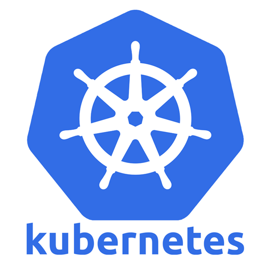

# Introducing Kubernetes

## What is Kubernetes?

- **Kubernetes** is a portable, extensible, open source platform for managing containerized workloads and services.
- It facilitates both declarative configuration and automation.
- We sometime refer Kubernetes as **K8s**, because of the eight characters between **k** and **s**.
- Kubernetes is an open-source platform for automating the deployment, scaling, and management of containerized applications.
- It was developed by Google and is now maintained by the Cloud Native Computing Foundation (CNCF).

- A Kubernetes cluster consists of a set of servers.
- These servers can be VMs or physical servers.
- Each node of the cluster can be either a Kubernetes **Master** or a **Worker** node.
- The _master nodes_ are responsible for managing and orchestrating the cluster resources, while the _worker nodes_ are meant for running the application workload.

## What is Container orchestration?

- Container orchestration is the automation of much of the operational effort required to run containerized workloads and services.
- This includes a wide range of things software teams need to manage a container’s lifecycle, including:
  - Managing container's lifecycle, including provisioning, stopping, restarting containers
  - Deployment of containers
  - Auto-scaling (up and down) application capacity
  - Networking
  - Load balancing and much more

## Other Container orchestration technologies

1.  Docker Swarm
2.  Apache Mesos
3.  RedHat OpenShift
4.  HashiCorp Nomad

## Docker vs Kubernetes

| Docker                                                                                                                                             | Kubernetes                                                                                                         |
| -------------------------------------------------------------------------------------------------------------------------------------------------- | ------------------------------------------------------------------------------------------------------------------ |
| 1. Docker is a containerization platform that allows us to package applications along with all the dependencies and libraries required to run them | 1. Kubernetes is designed to manage containerized applications at scale.                                           |
| 2. Docker containers are lightweight and can be deployed on any platform.                                                                          | 2. Kubernetes is a cluster (group of nodes) that work together to run and manage containers                        |
| 3. Docker only allows you to run containers on a single host.                                                                                      | 3. Kubernetes is a cluster (group of nodes) that work together to run and manage containers                        |
| 4. Docker lacks features like auto-healing, auto-scaling, and load-balancing                                                                       | 4. With K8s Controllers or Horizontal Pod Auto-scaling (HPA), solves the auto-scaling problem on Docker containers |
