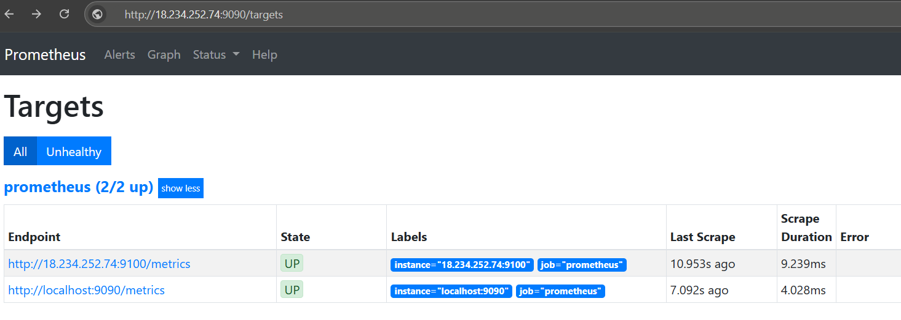

# `Prometheus` - Monitoring and Time series database Tool

- An open-source monitoring system with a dimensional data model, flexible query language, efficient time series database

- ## Core concepts

# Lab - Infrastructure monitoring (VM metrics) using Prometheus

This lab will demonstrate the process of building a monitoring stack, with service discovery and alerts; comprises of the following steps:

- **Step-01**: Install and configure `Prometheus` (self-hosted) on Amazon EC2 instance
- **Step-02**: Install and configure `Prometheus Node Exporter` on another Amazon EC2 instance
- **Step-03**: Prometheus `Service Discovery` on Amazon EC2 instance
- **Step-04**: Sending notifications using Prometheus `alertmanager`

## Step-01: Install and configure `Prometheus` (self-hosted) on Amazon EC2 instance

### 1.1 - Prerequisites

- AWS Account

### 1.2 - Create an Amazon EC2 instance for `Prometheus server`

- Name: Prometheus-Server
- AMI: Amazon Linux 2 (you may use any other supported distro)
- Instance type: t2.micro
- Key: <create_new_keypair>
- VPC and Subnet: <leave_to_default>
- Security Group: <create_new_sg>
  - Name: Prometheus-SG
  - Ingress: Allow 22 (SSH), 9090 (Prometheus) from any IPv4 address
  - Description: Prometheus server security group

### 1.3 - Install and configure `Prometheus`

- SSH to prometheus server (ec2 instance) created in the preceding step and execute the following steps:

```
# Create a new user for prometheus ops
sudo useradd --no-create-home prometheus

# Create following directories for prometheus config
sudo mkdir /etc/prometheus
sudo mkdir /var/lib/prometheus

# Download Prometheus
wget https://github.com/prometheus/prometheus/releases/download/v2.19.0/prometheus-2.19.0.linux-amd64.tar.gz

# Extract the downloaded tarball
tar xvfz prometheus-2.19.0.linux-amd64.tar.gz
```

- **Copy the _Prometheus_ and _Promtool_ files to respective locations**

```
sudo cp prometheus-2.19.0.linux-amd64/prometheus /usr/local/bin
sudo cp prometheus-2.19.0.linux-amd64/promtool /usr/local/bin/
sudo cp -r prometheus-2.19.0.linux-amd64/consoles /etc/prometheus
sudo cp -r prometheus-2.19.0.linux-amd64/console_libraries /etc/prometheus
sudo cp prometheus-2.19.0.linux-amd64/promtool /usr/local/bin/
```

- **Remove the tarball from system**

```
rm -rf prometheus-2.19.0.linux-amd64.tar.gz prometheus-2.19.0.linux-amd64
```

- **Create a Prometheus configuration file `prometheus.yml` on location `/etc/prometheus`**

```
# Create prometheus.yml file
sudo vi /etc/prometheus/prometheus.yml

# Add the following specs to the above created prometheus.yml file
global:
  scrape_interval: 15s
  external_labels:
    monitor: 'prometheus'

scrape_configs:
  - job_name: 'prometheus'
    static_configs:
      - targets: ['localhost:9090']
```

- **Create a file `prometheus.service` for Prometheus service on location `/etc/systemd/system`**

```
# Create the prometheus.service file
sudo vi /etc/systemd/system/prometheus.service

# Add the following specs to the above created prometheus.service file
[Unit]
Description=Prometheus
Wants=network-online.target
After=network-online.target

[Service]
User=prometheus
Group=prometheus
Type=simple
ExecStart=/usr/local/bin/prometheus \
    --config.file /etc/prometheus/prometheus.yml \
    --storage.tsdb.path /var/lib/prometheus/ \
    --web.console.templates=/etc/prometheus/consoles \
    --web.console.libraries=/etc/prometheus/console_libraries

[Install]
WantedBy=multi-user.target
```

- **Change the ownership of following files and directories to `prometheus` user**

```
sudo chown prometheus:prometheus /etc/prometheus
sudo chown prometheus:prometheus /usr/local/bin/prometheus
sudo chown prometheus:prometheus /usr/local/bin/promtool
sudo chown -R prometheus:prometheus /etc/prometheus/consoles
sudo chown -R prometheus:prometheus /etc/prometheus/console_libraries
sudo chown -R prometheus:prometheus /var/lib/prometheus
```

- **Start the `prometheus service`**

```
sudo systemctl daemon-reload
sudo systemctl enable prometheus
sudo systemctl start prometheus
```

### 1.4 - Access the Prometheus Web UI

- You can now access the Prometheus Dashboard (Web UI ) from the browser with following link: </br></br>
  **<prometheus_server_public_ip_or_dns_name>:9090**

## Step-02: Install and configure `Prometheus Node Exporter` on Amazon EC2 instance

### 2.1 - Create an EC2 instance for exporting metrics using Prometheus `node_exporter`

- Name: Prometheus-Node-Exporter
- AMI: Amazon Linux 2 (you may use any other supported distro)
- Instance type: t2.micro
- VPC and Subnet: <leave_to_default>
- Security Group: <create_new_sg>
  - Name: Prom-NodeExporter-SG
  - Ingress: Allow 22 (SSH), 9100 (Prometheus) from any IPv4 address
  - Description: Prometheus node exporter security group

### 2.2 - Install and configure Prometheus `node_exporter`

- **SSH to the _Prometheus-Node-Exporter_ VM and run the follwing commands**

```
# Create a new user for node_exporter config
sudo useradd --no-create-home node_exporter

# Download the prometheus node_exporter
wget https://github.com/prometheus/node_exporter/releases/download/v1.0.1/node_exporter-1.0.1.linux-amd64.tar.gz

# Extract the downloaded tarball
tar xzf node_exporter-1.0.1.linux-amd64.tar.gz

# Copy the node_exporter file to /usr/local/bin directory
sudo cp node_exporter-1.0.1.linux-amd64/node_exporter /usr/local/bin/node_exporter

# Remove the downloaded tarball as no longer required
rm -rf node_exporter-1.0.1.linux-amd64.tar.gz node_exporter-1.0.1.linux-amd64
```

### 2.3 - Create a node-exporter service file - `/etc/systemd/system/node-exporter.service`

```
# Create the node-exporter.service file
sudo vi /etc/systemd/system/node-exporter.service

# Add the following details to the node-exporter.service file
[Unit]
Description=Prometheus Node Exporter Service
After=network.target

[Service]
User=node_exporter
Group=node_exporter
Type=simple
ExecStart=/usr/local/bin/node_exporter

[Install]
WantedBy=multi-user.target
```

### 2.4 - Start the node-exporter service

```
sudo systemctl daemon-reload
sudo systemctl enable node-exporter
sudo systemctl start node-exporter
sudo systemctl status node-exporter
```

### 2.5 - Configure Prometheus server to pull metrics from Prometheus Targets

- Switch to _Prometheus-Server_ SSH console and update its configuration to pull metrics from Prometheus-Node-Exporter EC2 instance.

```
# Edit prometheus.yml file
sudo vi /etc/prometheus/prometheus.yml

# Add one more target to the targets list i.e node exporter VM
global:
  scrape_interval: 15s
  external_labels:
    monitor: 'prometheus'

scrape_configs:
  - job_name: 'prometheus'
    static_configs:
      - targets: ['localhost:9090', '<PUBLIC_IP_NODE_EXPORTER>:9090']
```

- Restart the prometheus server

```
# Restart the prometheus service
sudo systemctl restart prometheus

# Check the prometheus service status | should be in running state
sudo systemctl status prometheus
```

### 2.6 - Access the Prometheus Dashboard to access exported metrics

- Navigate to your browser >> Visit following URL: </br></br> **<prometheus_server_public_ip_or_dns_name>:9090/targets**
- You should see two endpoints, one for localhost and other for node exporter vm.



## Step-03: `Service Discovery` using Prometheus

### 3.1 - Create IAM User with programmatic access

### 3.2 - Configure Prometheus Service discovery

- Connect to Prometheus-Server we created in the [Step-01](#step-01-install-and-configure-prometheus-self-hosted-on-amazon-ec2-instance) over SSH.

- `Notice` - I've removed _targets_ properties and have replaced it _region_, _access keys_ and _port_ specs of any random node exporter (VM) in the same network listening on port 9100.

- `Note`: Replace the KEYS placeholders with your AWS IAM Access and Secrets keys.

```
sudo vi /etc/prometheus/prometheus.yml

# Update prometheus.yml with iam user + region specs
global:
  scrape_interval: 1s
  evaluation_interval: 1s

scrape_configs:
  - job_name: 'node'
    ec2_sd_configs:
      - region: us-east-1
        access_key: ACCESS_KEY_HERE
        secret_key: SECRET_ACCESS_KEY_HERE
        port: 9100
```

- Restart the Prometheus service

```
sudo systemctl restart prometheus
```

### 3.3 - Check if Prometheus server is able to discover node exporters automatically

- Navigate to the Prometheus server dashboard >> Go to <PUBLIC_IP_OR_DNS_OF_PROMETHEUS_SERVER>:9090/targets

- You should see other instances registered since Prometheus server is discovering all such EC2 instances in the same network.

## Step-04: Sending notifications (emails) using Prometheus `alertmanager`

- Prometheus can trigger notications when satisfies a rule.
- In this lab, I'm configuring my google account with Prometheus Alertmanager to send email based notifications.

### 4.1 - Install `alertmanager` on Prometheus server

```
wget https://github.com/prometheus/alertmanager/releases/download/v0.27.0/alertmanager-0.27.0.linux-amd64.tar.gz
tar xvfz alertmanager-0.27.0.linux-amd64.tar.gz

sudo cp alertmanager-0.27.0.linux-amd64/alertmanager /usr/local/bin
sudo cp alertmanager-0.27.0.linux-amd64/amtool /usr/local/bin/
sudo mkdir /var/lib/alertmanager

rm -rf alertmanager*
```

### 4.2 - Update Prometheus configuration for Alertmanager

### 4.3 - Configure Alert manager as a service

```
# Create a service file for alertmanager
sudo vi /etc/systemd/system/alertmanager.service

# Update the alertmanager.service file as follows
[Unit]
Description=Alert Manager
Wants=network-online.target
After=network-online.target

[Service]
Type=simple
User=prometheus
Group=prometheus
ExecStart=/usr/local/bin/alertmanager \
  --config.file=/etc/prometheus/alertmanager.yml \
  --storage.path=/var/lib/alertmanager

Restart=always

[Install]
WantedBy=multi-user.target
```

### 4.4 - Start the alertmanager service

```
sudo systemctl daemon-reload
sudo systemctl enable alertmanager
sudo systemctl start alertmanager
```

### 4.5 - Create Alertmanager rule - `/etc/prometheus/rules.yml`

```
# Create a file for alert manager rules
sudo vi /etc/prometheus/rules.yml

# Add the following config to rules.yml file

groups:
- name: Down
  rules:
  - alert: InstanceDown
    expr: up == 0
    for: 3m
    labels:
      severity: 'critical'
    annotations:
      summary: "Instance  is down"
      description: " of job  has been down for more than 3 minutes."
```

### 4.6 - `Change the ownership` of prometheus directory to `prometheus` user

```
sudo chown -R prometheus:prometheus /etc/prometheus
```

### 4.7 - Update Prometheus configuration for alertmanager - `/etc/prometheus/prometheus.yml`

- `Note`: Replace the KEYS placeholders with your aws access and secrets keys

```
# Edit prometheus.yml file
sudo vi /etc/prometheus/prometheus.yml

# Updated prometheus.yml file

global:
  scrape_interval: 1s
  evaluation_interval: 1s

rule_files:
 - /etc/prometheus/rules.yml

alerting:
  alertmanagers:
  - static_configs:
    - targets:
      - localhost:9093

scrape_configs:
  - job_name: 'node'
    ec2_sd_configs:
      - region: us-east-1
        access_key: AWS_ACCESS_KEY_HERE
        secret_key: AWS_SECRET_ACCESS_KEY_HERE
        port: 9100
```

### 4.8 - Restart the Prometheus service

```
sudo systemctl restart prometheus

# Check the prometheus service status after restarting it
sudo systemctl status prometheus
```

### 4.9 - It's time to Test the Alert manager notification setup

- Stop the Prometheus-Node-Exporter machine (EC2 instance) we configured in [Step-02](#step-02-install-and-configure-prometheus-node-exporter-on-amazon-ec2-instance)

- Wait for 3 minutes and check the Alertmanager URL that is installed in your prometheus-server instance: </br></br> <PUBLIC_IP_OF_PROMETHEUS_SERVER>:9093/#/alerts.
- Now, check your email inbox. You must have recieved an email notification from prometheus.

## References

- [Prometheus Download](https://prometheus.io/download/)
- [Prometheus Architecture](https://prometheus.io/assets/architecture.png)
- [Prometheus Exporters](https://prometheus.io/docs/instrumenting/exporters/)
- [Prometheus node_exporter]()
- Name the auto discovered ec2 instances by their _Name_ tag
  - https://github.com/prometheus/prometheus/blob/main/discovery/README.md
  - https://prometheus.io/docs/prometheus/latest/configuration/configuration/#relabel_config
  - https://stackoverflow.com/questions/60429457/how-to-change-my-instance-names-on-prometheus
